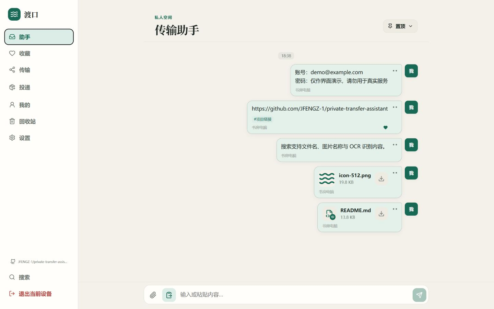
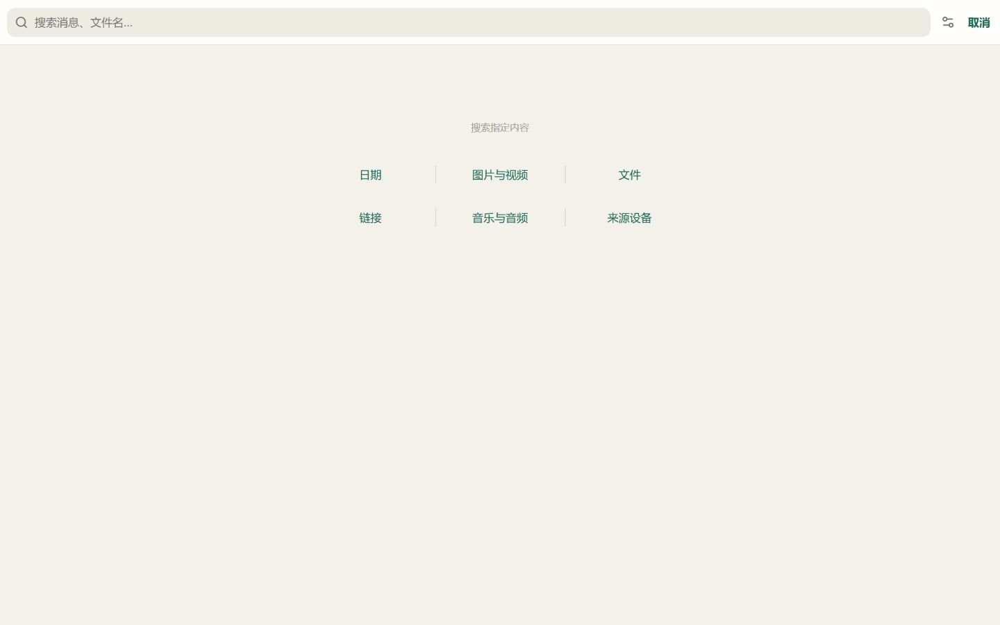
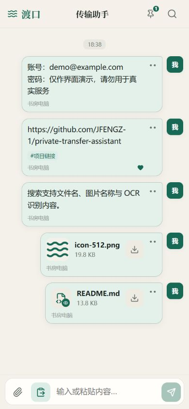
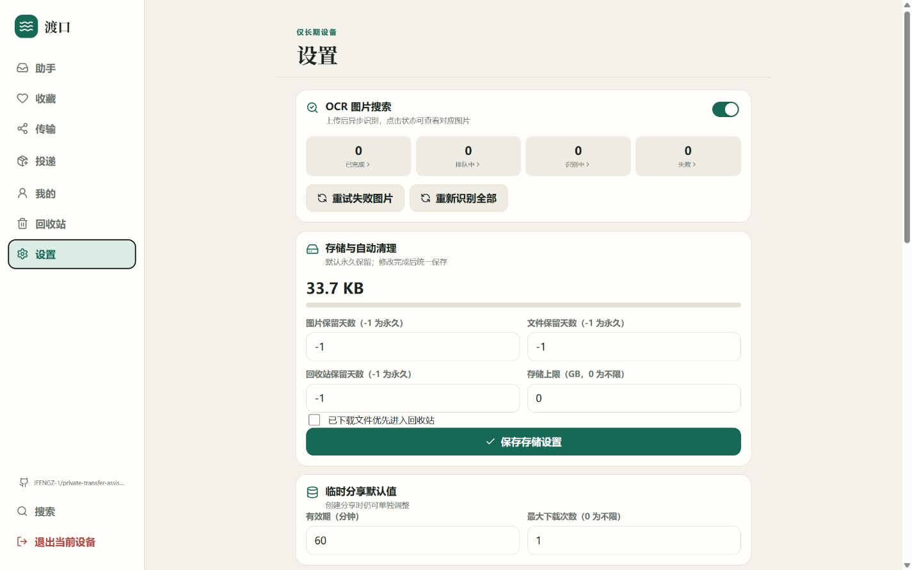

<div align="center">
  
  <h1>Dukou · Private Transfer Assistant</h1>
  <p>A self-hosted cross-device clipboard and file transfer service that requires no account and no shared local network.</p>

  [简体中文](./README.zh-CN.md) · [Live Demo](https://jfengz-1.github.io/private-transfer-assistant/) · [Baota Deployment Guide (Chinese)](./DEPLOYMENT-BAOTA-LNMP.md)

  [](https://github.com/JFENGZ-1/private-transfer-assistant/releases/latest)
  [](https://github.com/JFENGZ-1/private-transfer-assistant/stargazers)
  [](https://nodejs.org/)
  [](https://vuejs.org/)
  [](#native-linux-one-click-installation-baota-optional)

  [Screenshots](#screenshots) · [Capabilities](#core-capabilities) · [Install](#native-linux-one-click-installation-baota-optional) · [Latest Release](https://github.com/JFENGZ-1/private-transfer-assistant/releases/latest)
</div>

## What Problems Does Dukou Solve?

- **Your phone and computer are on different networks.** Transfer text, images, video, and arbitrary files through your own HTTPS domain without LAN discovery.
- **You do not want to sign into a third-party account on a temporary device.** Enter the main passphrase for a temporary session that disappears after refresh or tab close. Use the separate admin passphrase only when authorizing a trusted device.
- **Old files are difficult to find.** Search message text, original file names, image names, tags, source devices, and OCR-recognized image text, with fast content-type filters.
- **You need to hand content to someone else safely.** Create expiring links and QR codes for one or many messages, or create an external drop link that accepts files and plain text.

Your database, uploaded files, and OCR data remain on your own server. The current stable release is **v1.4.7**. Dukou itself does not depend on Baota: the application and OCR worker run as systemd services. Public access requires Nginx or another HTTPS reverse proxy; the repository's fully tested walkthrough currently uses [Baota LNMP](./DEPLOYMENT-BAOTA-LNMP.md).

## Screenshots

<table>
  <tr>
    <td align="center" width="50%">
      <strong>Desktop conversation and file transfer</strong><br><br>
      
    </td>
    <td align="center" width="50%">
      <strong>Content-type search</strong><br><br>
      
    </td>
  </tr>
  <tr>
    <td align="center" width="50%">
      <strong>Responsive mobile interface</strong><br><br>
      
    </td>
    <td align="center" width="50%">
      <strong>OCR and storage settings</strong><br><br>
      
    </td>
  </tr>
</table>

> Screenshots are generated from isolated fictional data and contain no real passphrase or user file. The interface may evolve between releases.

## Core Capabilities

- **Chat-style cross-device transfer:** send text, images, videos, and arbitrary files with source-device names, upload progress, and realtime updates.
- **Two-level device authorization:** the main passphrase opens a temporary session; the admin passphrase authorizes persistent devices. Settings, private messages, and the trash are restricted to trusted devices.
- **Message organization:** favorites, pins, tags, notes, message merging, free-form copy/edit, and trusted-device-only trash recovery and batch operations.
- **Full-text and categorized search:** search text, links, file names, image names, and OCR text; browse by date, image/video, file, link, audio, or source device.
- **Sharing and external drops:** share multiple text/file messages through one link with expiration, download limits, QR codes, and editable parameters; receive files or plain text through drop links.
- **Unified preview:** in-app preview for images, video, audio, PDF, and isolated HTML. PDF.js renders PDFs on mobile browsers without a built-in PDF viewer.
- **Lightweight self-hosting:** Fastify, Vue 3, SQLite, local file storage, and RapidOCR, tuned for a small 2-core / 2 GB server.

Browser system notifications are not enabled yet. Realtime synchronization while the page is open is unaffected.

## Native Linux One-click Installation (Baota Optional)

The installer supports 64-bit systemd Linux distributions with `apt`, `dnf`, or `yum`, including the legacy Alibaba Cloud CentOS 8.2 compatibility path. **Baota and Nginx do not need to be installed before running it.** The script installs the application, database runtime, Node.js, Python/OCR, and systemd services; it does not issue a TLS certificate or create the public reverse proxy.

Create a server snapshot first, point a domain at the server, and add 1–2 GB of swap on a 2 GB machine. Then run as `root` over SSH or any root terminal:

```bash
curl -fsSL https://raw.githubusercontent.com/JFENGZ-1/private-transfer-assistant/v1.4.7/scripts/bootstrap-baota-native.sh | bash
```

The `baota-native` filename is retained for compatibility with existing install commands; Baota is not a runtime dependency.

The interactive installer asks for:

1. A domain already pointing to the server, without `https://`.
2. A main passphrase of at least eight characters, entered twice.
3. A different admin passphrase of at least eight characters, entered twice.

Passphrase input is hidden. On CentOS 8.2, the installer switches to the final CentOS 8.5.2111 archive snapshot and builds an isolated Python 3.11 without replacing the system Python. Installation, tests, production builds, and a real OCR inference must finish with:

```text
OCR inference OK: OCR TEST 123456
安装完成
```

Afterward, configure Nginx or another HTTPS reverse proxy to forward the domain to `http://127.0.0.1:3000`. Baota users can create a static site and paste the generated snippets; users without Baota can use system Nginx with Certbot/acme.sh. The generated Nginx snippets are:

```text
/opt/private-transfer-assistant/nginx/location.conf
/opt/private-transfer-assistant/nginx/server-directives.conf
```

Expose only ports 80 and 443 to the public internet. Restrict SSH and any control-panel port to your own IP, and **never expose port 3000**. The detailed tested walkthrough is currently available in the [Chinese Baota LNMP deployment guide](./DEPLOYMENT-BAOTA-LNMP.md).

To inspect the network script before executing it:

```bash
curl -fL https://raw.githubusercontent.com/JFENGZ-1/private-transfer-assistant/v1.4.7/scripts/bootstrap-baota-native.sh -o /root/bootstrap-baota-native.sh
less /root/bootstrap-baota-native.sh
bash /root/bootstrap-baota-native.sh
```

## Native Linux One-click Upgrade

This applies to servers previously installed by the script and containing `/etc/private-transfer-assistant.env`. Upgrades reuse the domain, port, cookie secret, runtime settings, database, and uploaded files. They do not ask for the two passphrases again.

Create a snapshot before upgrading. You can also create a consistent local backup:

```bash
systemctl stop private-transfer-assistant private-transfer-assistant-ocr

tar -czf /root/private-transfer-backup-$(date +%Y%m%d-%H%M%S).tar.gz \
  /var/lib/private-transfer-assistant \
  /etc/private-transfer-assistant.env

systemctl start private-transfer-assistant private-transfer-assistant-ocr
```

Run the same installer again as `root`:

```bash
curl -fsSL https://raw.githubusercontent.com/JFENGZ-1/private-transfer-assistant/v1.4.7/scripts/bootstrap-baota-native.sh | bash
```

The installer downloads the published source, runs server/web tests, builds production assets, and performs a real OCR inference. It creates a new release and switches `/opt/private-transfer-assistant/current` only after the local health check succeeds; otherwise it attempts to restore the previous release. The current release and two previous releases are retained, while older OCR virtual environments are removed.

Verify the upgrade:

```bash
grep '"version"' /opt/private-transfer-assistant/current/package.json | head -1
systemctl is-active private-transfer-assistant
systemctl is-active private-transfer-assistant-ocr
curl -s http://127.0.0.1:3000/api/auth/status
```

For v1.4.7, expect `"version": "1.4.7"`, two `active` lines, and `{"initialized":true,...}`. For errors:

```bash
journalctl -u private-transfer-assistant -n 100 --no-pager
journalctl -u private-transfer-assistant-ocr -n 100 --no-pager
```

If a mobile browser or installed PWA still shows the old interface, fully close and reopen it. Do not manually delete `/var/lib/private-transfer-assistant`, `/etc/private-transfer-assistant.env`, or the active release directory.

## Additional Feature Details

- The privacy lock is enforced across message lists, search, thumbnails, downloads, and realtime events; locked messages are visible only on trusted devices.
- The trash is hidden from temporary sessions. Listing deleted messages, reading their edit history, restoring them, and permanently deleting them are enforced as trusted-device-only operations by the server.
- The OCR queue exposes recognized text, supports history reindexing, and includes a real-image diagnostic with returned recognition results.
- Trusted devices can change both passphrases in Settings. If all trusted devices are lost, a server administrator can securely reset them.
- PWA installation, Web Share Target, custom application icons, site title, and browser-tab title are supported.

## Server Requirements

- 2 CPU cores and 2 GB RAM; 1–2 GB swap is recommended.
- 64-bit Linux with systemd and `apt`, `dnf`, or `yum`.
- A domain pointing to the public server IP and a valid HTTPS certificate for production access.
- Nginx or another reverse proxy supporting WebSocket and streaming uploads; Baota is optional.
- Public TCP 80/443 in the cloud firewall. Port 3000 must remain private.
- Enough disk space for the database, uploads, temporary files, and off-server backups.

The installer includes a legacy Alibaba Cloud CentOS 8.2 path and installs application-specific Node.js and Python runtimes without replacing the system runtime.

## OCR Configuration

The global OCR switch and reindex operation are available from Settings on a trusted device. The search-panel option only changes the current search scope; it does not run OCR on demand.

RapidOCR and ONNX Runtime process images asynchronously after upload. Search never starts a new inference. The default worker uses one job and one inference thread, then releases the model after five idle minutes, which is suitable for a 2-core / 2 GB host.

Common variables in `/etc/private-transfer-assistant.env`:

| Variable | Default | Purpose |
| --- | ---: | --- |
| `OCR_ENABLED` | `true` | Service-level master switch; the Settings switch applies on top of it |
| `OCR_MAX_EDGE` | `2200` | Longest edge before recognition; larger values improve tiny-text recall but cost more CPU |
| `OCR_DET_LIMIT_SIDE` | `1280` | Detection input limit and the main speed/recall trade-off |
| `OCR_MAX_IMAGE_PIXELS` | `40000000` | Rejects decompression-bomb images |
| `OCR_MIN_SCORE` | `0.45` | Minimum confidence stored in the search index |
| `OCR_MAX_ATTEMPTS` | `3` | Maximum attempts per image |
| `OCR_CPU_THREADS` | `1` | ONNX/math threads; keep at one on a 2-core host |
| `OCR_RELEASE_MODEL_AFTER_SECONDS` | `300` | Releases the idle model; use `0` to keep it resident |

If OCR competes with other sites on the same server, lower `OCR_MAX_EDGE` to `1600` and keep `OCR_CPU_THREADS=1`, then restart the worker:

```bash
systemctl restart private-transfer-assistant-ocr
journalctl -u private-transfer-assistant-ocr -n 100 --no-pager
```

OCR failures do not block image preview or download. Trusted devices can inspect pending, processing, completed, and failed jobs, expand completed images to read recognized text, reindex historical images, or run the real-image diagnostic.

## Backup

A complete backup must contain the SQLite database, original files, and production configuration. Briefly stop both services to avoid inconsistent uploads or deletes during the archive:

```bash
systemctl stop private-transfer-assistant private-transfer-assistant-ocr

tar -czf /root/private-transfer-backup-$(date +%Y%m%d-%H%M%S).tar.gz \
  /var/lib/private-transfer-assistant \
  /etc/private-transfer-assistant.env

systemctl start private-transfer-assistant private-transfer-assistant-ocr
```

Copy the archive to another server, NAS, or object storage. Also back up the reverse-proxy configuration and TLS certificates. A backup on the same disk does not protect against disk failure.

## Forgotten Passphrases and Secure Reset

Dukou supports passphrase changes and secure resets but never stores or reveals the original plaintext:

- If a trusted device and the admin passphrase are still available, use **Settings → Change passphrases**.
- If no trusted device remains or the admin passphrase is also lost, a server administrator can set new values with the bundled script.

Reset the main passphrase from a root terminal. `read -s` hides input:

```bash
cd /opt/private-transfer-assistant/current
read -s -p 'New main passphrase: ' NEW_MAIN; echo
runuser -u transfer -- env \
  DB_PATH=/var/lib/private-transfer-assistant/transfer.db \
  RESET_MAIN_PASSWORD="$NEW_MAIN" \
  /opt/private-transfer-assistant/bin/node scripts/reset-passwords.mjs
unset NEW_MAIN
```

Reset the admin passphrase:

```bash
read -s -p 'New admin passphrase: ' NEW_ADMIN; echo
runuser -u transfer -- env \
  DB_PATH=/var/lib/private-transfer-assistant/transfer.db \
  RESET_ADMIN_PASSWORD="$NEW_ADMIN" \
  /opt/private-transfer-assistant/bin/node scripts/reset-passwords.mjs
unset NEW_ADMIN
```

Passphrases must be at least eight characters and must differ. The server reset invalidates temporary sessions and trusted devices so that a lost device cannot keep using an old session.

## Operations

```bash
# Service status
systemctl status private-transfer-assistant --no-pager
systemctl status private-transfer-assistant-ocr --no-pager

# Recent logs
journalctl -u private-transfer-assistant -n 100 --no-pager
journalctl -u private-transfer-assistant-ocr -n 100 --no-pager

# Restart
systemctl restart private-transfer-assistant
systemctl restart private-transfer-assistant-ocr

# Local health check
curl -i http://127.0.0.1:3000/api/auth/status

# Actual memory use
systemctl show private-transfer-assistant -p MemoryCurrent -p MemoryPeak
systemctl show private-transfer-assistant-ocr -p MemoryCurrent -p MemoryPeak
```

If the local health check succeeds but public access fails, inspect the reverse proxy, TLS configuration, and firewall.

## Security Notes

- Use HTTPS. The application listens on `127.0.0.1:3000`; never expose that port publicly.
- Temporary credentials are not written to cookies, `localStorage`, or `sessionStorage`. Trusted devices use signed HttpOnly, Secure, SameSite=Strict cookies and can be individually revoked.
- Cookie-authenticated writes validate `Origin` and `Sec-Fetch-Site` to block cross-site request forgery.
- Keep `X-Frame-Options: SAMEORIGIN` and `frame-ancestors 'self'` for same-origin PDF/HTML preview. Do not use `DENY`/`'none'` and do not cache API, share, drop, or capability-token requests.
- Settings, device management, the trash, global OCR controls, and drop links require a trusted device. Passphrase changes and global logout require the admin passphrase again.
- Privacy-locked content is filtered by the server in lists, search, downloads, thumbnails, and realtime events. Content already downloaded, copied, or captured cannot be revoked.
- OCR must read original images, so this is not an end-to-end encrypted, server-blind system. Treat the database, files, and backups as sensitive and encrypt off-server backups.
- Services run as the non-login `transfer` user. Program/data directories remain outside the web root and are not writable by Nginx or PHP.
- Public share and external drop links are public entry points. Use short expiration, count, and size limits, and revoke links you no longer need.
- Keep `/etc/private-transfer-assistant.env` owned by `root:transfer` with mode `0640`. Never commit cookie secrets, production configuration, backups, TLS keys, or SSH keys.

## Data Locations

| Content | Server path |
| --- | --- |
| Active release | `/opt/private-transfer-assistant/current` |
| Current and two previous releases | `/opt/private-transfer-assistant/releases` |
| Node.js and Python | `/opt/private-transfer-assistant/bin`, `/opt/private-transfer-python-3.11.16` |
| Generated Nginx snippets | `/opt/private-transfer-assistant/nginx` |
| SQLite database | `/var/lib/private-transfer-assistant/transfer.db` |
| Uploaded files | `/var/lib/private-transfer-assistant/files` |
| Temporary files | `/var/lib/private-transfer-assistant/tmp` |
| Automatic backups | `/var/backups/private-transfer-assistant` |
| Production configuration and secrets | `/etc/private-transfer-assistant.env` |

Do not use the website root as the data directory, and never restore the database without the matching `files/` directory. Installer upgrades preserve production configuration, the database, and uploaded files while switching releases through the `current` symlink.
